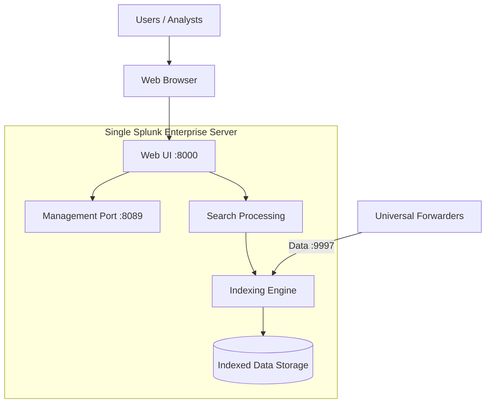
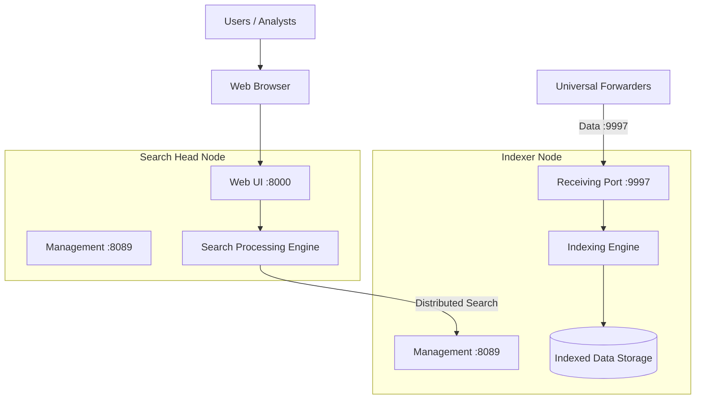
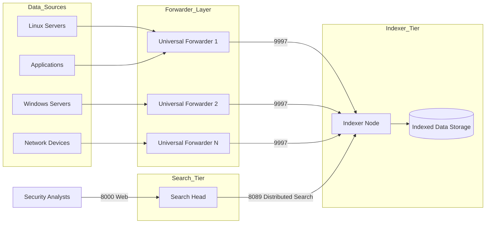

# Splunk Enterprise Architecture Diagrams

This document contains complete architecture diagrams for:

- Single Instance Deployment
- Distributed Deployment (Indexer + Search Head)
- Distributed Deployment with Forwarders

Diagrams are written using Mermaid for GitHub rendering.

---

# 1️⃣ Single Instance Architecture (All-in-One)



## Description

- Everything runs on one node.
- Receives logs from Universal Forwarders.
- Performs indexing and search locally.
- Suitable for lab, PoC, and small environments.

---

# 2️⃣ Distributed Architecture (Indexer + Search Head)



## Description

- Search Head handles user access and query execution.
- Indexer stores and indexes data.
- Search Head communicates with Indexer over management port 8089.
- Forwarders send data only to Indexer.

---

# 3️⃣ Distributed Deployment with Forwarders (Production Layout)



## Production Flow Explanation

1. Data sources generate logs.
2. Universal Forwarders collect logs.
3. Forwarders send data to Indexer (port 9997).
4. Indexer parses, indexes, and stores data.
5. Search Head queries Indexer using distributed search.
6. Users access dashboards via port 8000.

---

# 4️⃣ Port Communication Matrix

| Component | Port | Purpose |
|------------|------|----------|
| Web UI | 8000 | User access |
| Management | 8089 | API & distributed search |
| Forwarder Receiver | 9997 | Data ingestion |
| HTTP Event Collector | 8088 | Optional HEC |

---

# 5️⃣ Recommended Network Segmentation

- Search Head → Indexer (Allow 8089)
- Forwarders → Indexer (Allow 9997)
- Users → Search Head (Allow 8000)
- Restrict 8089 from public access

---

# 6️⃣ Enterprise-Scale Expansion (Future)

The architecture can scale to include:

- Multiple Indexers (Indexer Cluster)
- Multiple Search Heads (Search Head Cluster)
- Deployment Server
- Monitoring Console
- Heavy Forwarders
- License Master

This document currently reflects Single and Basic Distributed architecture as implemented in the automation script.

---

---

# 7️⃣ Running Instructions

This section explains how to deploy the architecture using the provided automation script.

## Prerequisites

- Root or sudo access
- Splunk Enterprise `.tgz` package OR download URL
- Open required firewall ports
- Minimum recommended resources:
  - 8GB RAM (Indexer)
  - 4GB RAM (Search Head)
  - 2+ CPU cores

---

## Step 1: Prepare the Script

```bash
chmod +x splunk_auto.sh
```

---

## Step 2: Single Instance Deployment

Run on one server:

```bash
sudo SPLUNK_TGZ=/path/to/splunk-9.x.x-linux-amd64.tgz \
     SPLUNK_ADMIN_PASS='StrongPassword!' \
     ./splunk_auto.sh single
```

Access Web UI:

```
http://<server-ip>:8000
```

---

## Step 3: Distributed Deployment

### 3.1 Install Indexer Node

Run on indexer server:

```bash
sudo SPLUNK_TGZ=/path/to/splunk.tgz \
     SPLUNK_ADMIN_PASS='StrongPassword!' \
     SPLUNK_SERVER_NAME='idx-01' \
     ./splunk_auto.sh indexer
```

Ensure port 9997 and 8089 are open.

---

### 3.2 Install Search Head Node

Run on search head server:

```bash
sudo SPLUNK_TGZ=/path/to/splunk.tgz \
     SPLUNK_ADMIN_PASS='StrongPassword!' \
     INDEXER_HOST=<indexer-ip> \
     SPLUNK_SERVER_NAME='sh-01' \
     ./splunk_auto.sh searchhead
```

Ensure port 8089 is reachable from Search Head to Indexer.

---

## Step 4: Configure Universal Forwarder (Example)

On client machine:

```bash
/opt/splunkforwarder/bin/splunk add forward-server <indexer-ip>:9997
/opt/splunkforwarder/bin/splunk restart
```

---

## Step 5: Verify Deployment

Check service status:

```bash
systemctl status splunk
```

Check listening ports:

```bash
ss -tulnp | grep splunk
```

Verify indexer connection from Search Head:

```bash
/opt/splunk/bin/splunk list search-server
```

---

## Step 6: Access URLs

| Component | URL |
|------------|------|
| Single Instance | http://<server-ip>:8000 |
| Search Head | http://<search-head-ip>:8000 |
| Management API | https://<server-ip>:8089 |

---

# Deployment Complete

You now have:

- Single instance OR
- Basic distributed (Indexer + Search Head)

Architecture can be extended to clustering and high availability as needed.

---

# 8️⃣ Uninstall Instructions (Full Removal)

Use this when you want Splunk completely removed from the server.

## What the uninstall does

- Stops Splunk cleanly (CLI + systemd best-effort)
- Disables the Splunk systemd service
- Removes the Splunk installation directory (default: `/opt/splunk`)
- Optionally removes the `splunk` user and group

## How to run

1. Ensure you have the uninstall script available in the repo as `uninstall_splunk.sh`.
2. Make it executable:
   - `chmod +x uninstall_splunk.sh`
3. Run (keep user/group):
   - `sudo ./uninstall_splunk.sh`
4. Run (also remove `splunk` user/group):
   - `sudo REMOVE_USER_GROUP=true ./uninstall_splunk.sh`

## After uninstall

- If you opened firewall ports (8000/8089/9997), remove rules according to your environment.
- Verify removal:
  - `/opt/splunk/bin/splunk` should not exist
  - `systemctl status splunk` should show not found/disabled

---

# 9️⃣ Update / Upgrade Instructions

Use this when you want to upgrade Splunk to a newer version using the `.tgz` method.

## Recommended upgrade flow

1. Backup configs and data (at least `etc/` and relevant parts of `var/`).
2. Stop Splunk.
3. Extract the new Splunk `.tgz` over the existing install location.
4. Start Splunk and accept license prompts if needed.
5. Validate version, service health, and search/indexing.

## How to run

1. Ensure you have the upgrade script available in the repo as `upgrade_splunk.sh`.
2. Make it executable:
   - `chmod +x upgrade_splunk.sh`
3. Upgrade using a local tgz path:
   - `sudo NEW_SPLUNK_TGZ=/path/to/new-splunk.tgz ./upgrade_splunk.sh`
4. Upgrade using a URL:
   - `sudo NEW_SPLUNK_TGZ_URL='https://.../splunk-new.tgz' ./upgrade_splunk.sh`

## Post-upgrade validation checklist

- Check service:
  - `systemctl status splunk`
- Confirm version:
  - `/opt/splunk/bin/splunk version`
- Verify Search Head ↔ Indexer connectivity (distributed mode):
  - `/opt/splunk/bin/splunk list search-server`
- Confirm data ingestion continues on indexer (9997) and UI works (8000)

---

End of Architecture Document


